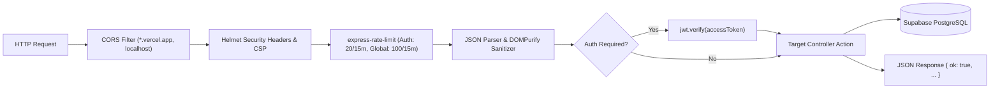
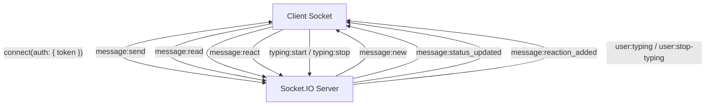

<p align="center">
  
</p>

<h1 align="center">ProjectHive 🐝 — REST API & Real-Time Socket Reference</h1>

<p align="center">
  <strong>Comprehensive API Reference for Engineers, Integrators & Platform Developers</strong>
</p>

---

## 1. Gateway Pipeline & Middleware Architecture

Every incoming request passes through an OWASP-compliant security pipeline before hitting controller logic:



---

## 2. Authentication & Authorization

All authenticated endpoints require an `Authorization` header containing a valid JWT Bearer token:
```http
Authorization: Bearer <access_token>
```

### Endpoints

#### `POST /api/auth/register`
Create a new student user account.
- **Request Body**:
  ```json
  {
    "email": "student@university.edu",
    "password": "StrongPassword123!",
    "firstName": "John",
    "lastName": "Doe",
    "university": "State University"
  }
  ```
- **Response (201 Created)**:
  ```json
  {
    "ok": true,
    "user": {
      "id": "uuid",
      "email": "student@university.edu",
      "firstName": "John",
      "lastName": "Doe",
      "role": "student"
    },
    "accessToken": "jwt_token_string",
    "refreshToken": "refresh_token_string"
  }
  ```

#### `POST /api/auth/login`
Authenticate existing user and issue session tokens.
- **Request Body**:
  ```json
  {
    "email": "student@university.edu",
    "password": "StrongPassword123!"
  }
  ```
- **Response (200 OK)**:
  ```json
  {
    "ok": true,
    "user": { "id": "uuid", "email": "student@university.edu", "role": "student" },
    "accessToken": "jwt_token_string",
    "refreshToken": "refresh_token_string"
  }
  ```

#### `POST /api/auth/refresh`
Rotate an expired access token using a valid refresh token.
- **Request Body**:
  ```json
  {
    "refreshToken": "refresh_token_string"
  }
  ```
- **Response (200 OK)**:
  ```json
  {
    "ok": true,
    "accessToken": "new_jwt_token_string",
    "refreshToken": "new_refresh_token_string"
  }
  ```

---

## 3. Multimodal AI Copilot ("HiveMind AI")

#### `POST /api/ai/chat`
Execute cascading multimodal reasoning across Groq Llama 3.3, Google Gemini 2.5 Flash, and OpenRouter.
- **Headers**: `Authorization: Bearer <token>`
- **Request Body**:
  ```json
  {
    "message": "Can you review this React architecture snippet or diagram?",
    "imageBase64": "data:image/png;base64,iVBORw0KGgoAAAANS...",
    "mimeType": "image/png",
    "context": {
      "currentRoute": "/teams/squad-123",
      "projectId": "proj-abc"
    }
  }
  ```
- **Response (200 OK)**:
  ```json
  {
    "ok": true,
    "reply": "### Architecture Review\nYour component decoupling looks clean...",
    "provider": "gemini",
    "model": "gemini-2.5-flash"
  }
  ```

#### `POST /api/ai/generate-project`
Generate structured university hackathon and capstone project proposals.
- **Request Body**:
  ```json
  {
    "skills": ["React", "Python", "Computer Vision"],
    "category": "Healthcare AI",
    "difficulty": "Advanced"
  }
  ```
- **Response (200 OK)**:
  ```json
  {
    "ok": true,
    "proposal": {
      "title": "RetinaScan AI",
      "description": "Real-time mobile diagnostic tool for diabetic retinopathy...",
      "timeline": "6 Weeks",
      "difficulty": "Advanced",
      "techStack": ["Next.js", "FastAPI", "PyTorch", "TailwindCSS"]
    }
  }
  ```

---

## 4. LiveKit Video & Audio Calling

#### `POST /api/calls/token`
Generate a scoped LiveKit SFU access token for video/audio room participation.
- **Headers**: `Authorization: Bearer <token>`
- **Request Body**:
  ```json
  {
    "roomName": "team-workspace-123",
    "participantName": "John Doe"
  }
  ```
- **Response (200 OK)**:
  ```json
  {
    "ok": true,
    "token": "livekit_access_token_jwt",
    "liveKitUrl": "wss://project-hive-o0q9p17e.livekit.cloud"
  }
  ```

---

## 5. Team Workspace & Squad Discovery

#### `GET /api/teams`
List all squads with optional category and skill search filters.
- **Query Params**: `?category=web&search=python&page=1&limit=10`
- **Response (200 OK)**:
  ```json
  {
    "ok": true,
    "teams": [
      {
        "id": "team-uuid",
        "name": "NeuroVision Hackers",
        "description": "Building an AI-driven vision assistant",
        "category": "Artificial Intelligence",
        "member_count": 3,
        "max_members": 5,
        "recruiting_status": "recruiting"
      }
    ]
  }
  ```

#### `GET /api/teams/:id`
Retrieve comprehensive squad details including full member roster, leader information, and hiring status.
- **Response (200 OK)**:
  ```json
  {
    "ok": true,
    "team": {
      "id": "team-uuid",
      "name": "NeuroVision Hackers",
      "leader": { "id": "leader-uuid", "name": "Alice Chen", "email": "alice@uni.edu" },
      "members": [
        { "id": "member-uuid", "name": "Bob Smith", "role": "member" }
      ]
    }
  }
  ```

#### `POST /api/teams/:id/requests`
Submit a join request to a squad.
- **Request Body**:
  ```json
  {
    "message": "Hi, I have 2 years of React experience and would love to join!"
  }
  ```

#### `POST /api/teams/:id/requests/:requestId/:action`
Leader responds to a pending applicant (`action`: `accept` or `reject`).
- **Response (200 OK)**:
  ```json
  {
    "ok": true,
    "message": "Applicant accepted into the squad"
  }
  ```

#### `POST /api/teams/:id/transfer-leadership`
Leader transfers ownership of the squad to another member.
- **Request Body**:
  ```json
  {
    "newLeaderId": "target-user-uuid"
  }
  ```
- **Response (200 OK)**:
  ```json
  {
    "ok": true,
    "message": "Leadership transferred successfully"
  }
  ```

---

## 6. Messaging & Chat

#### `GET /api/messages/:userId`
Fetch direct message conversation history with another user.
- **Response (200 OK)**:
  ```json
  {
    "ok": true,
    "messages": [
      {
        "id": "msg-uuid",
        "sender_id": "user-1",
        "receiver_id": "user-2",
        "content": "Hey, let's sync on the demo.",
        "status": "read",
        "created_at": "2026-09-04T12:00:00Z"
      }
    ]
  }
  ```

---

## 7. Community Social Feed & Reactions

#### `GET /api/posts`
Fetch paginated community feed posts with author profiles and media attachments.
- **Query Params**: `?page=1&limit=20`

#### `POST /api/posts`
Publish a new community post.
- **Request Body**:
  ```json
  {
    "content": "Just deployed our new computer vision model! Check it out:",
    "imageUrl": "https://storage.googleapis.com/demo.png",
    "postType": "project"
  }
  ```

#### `POST /api/posts/:id/react`
React to a community post with an emoji.
- **Request Body**:
  ```json
  {
    "emoji": "🔥"
  }
  ```

---

## 8. Enterprise Admin Console (`/api/admin/*`)

*All admin endpoints require an authenticated user with `role: "admin"`.*

| Method | Endpoint | Description |
|---|---|---|
| `GET` | `/api/admin/stats` | Real-time telemetry, user count, message volume, and server ping |
| `GET` | `/api/admin/users` | List all users with login hardware, IP address, and role info |
| `PATCH` | `/api/admin/users/:id/role` | Elevate or demote user role (`admin` ↔ `student`) |
| `PATCH` | `/api/admin/users/:id/ban` | Ban or unban bad actors instantly |
| `DELETE` | `/api/admin/users/:id` | Permanently delete bad actor account |
| `GET` | `/api/admin/posts` | Audit all public feed posts and uploaded attachments |
| `DELETE` | `/api/admin/posts/:id` | Remove violating content |
| `GET` | `/api/admin/tickets` | List student helpdesk and support tickets |
| `PATCH` | `/api/admin/tickets/:id/resolve` | Mark ticket as resolved or reopened |
| `GET` | `/api/admin/system-flags` | Fetch platform kill-switches (maintenance, registration, email) |
| `PATCH` | `/api/admin/system-flags` | Update platform kill-switch settings |
| `GET` | `/api/admin/audit-logs` | Live immutable administrative audit trail |

---

## 9. Real-Time Socket.IO Event Reference



| Event Name | Direction | Payload | Description |
|---|---|---|---|
| `connect` | Client → Server | `{ auth: { token } }` | Authenticate WebSocket connection |
| `message:send` | Client → Server | `{ receiverId, teamId, content }` | Send real-time chat message |
| `message:new` | Server → Client | `{ message }` | Receive incoming message |
| `message:read` | Client → Server | `{ messageId, senderId }` | Mark message as read |
| `message:status_updated`| Server → Client | `{ messageId, status: 'read' }` | Notify sender of delivery/read status |
| `message:react` | Client → Server | `{ messageId, emoji }` | Add emoji reaction to message |
| `message:reaction_added`| Server → Client | `{ messageId, emoji, userId }` | Broadcast new reaction |
| `typing:start` | Client → Server | `{ roomId }` | Signal that user started typing |
| `typing:stop` | Client → Server | `{ roomId }` | Signal that user stopped typing |
| `user:online` | Server → Client | `{ userId }` | User presence indicator |
| `user:offline` | Server → Client | `{ userId }` | User disconnect indicator |

---

## 📜 License

This documentation and API specification are open-source under the **[MIT License](LICENSE)**.

Copyright (c) 2025-2026 ProjectHive Contributors.
