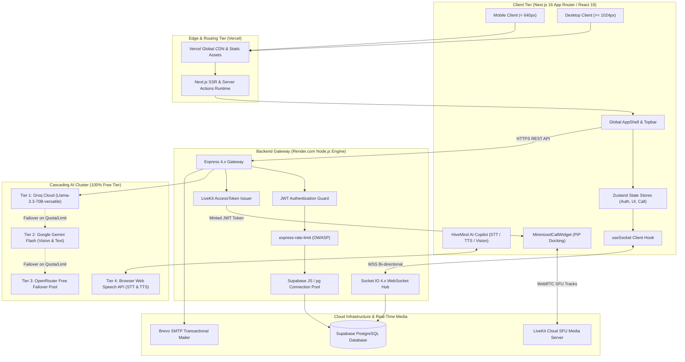
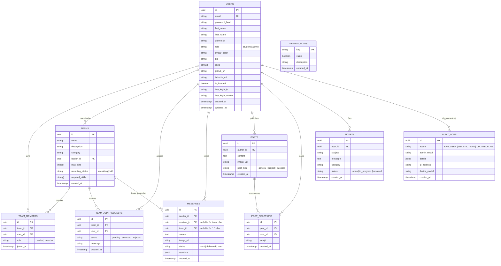
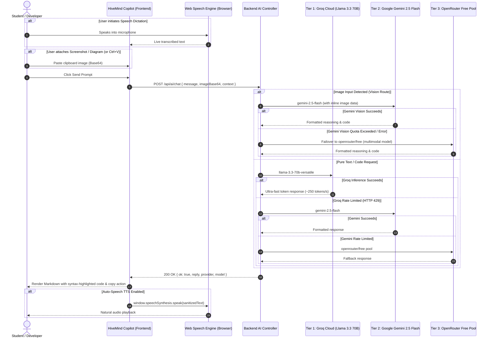
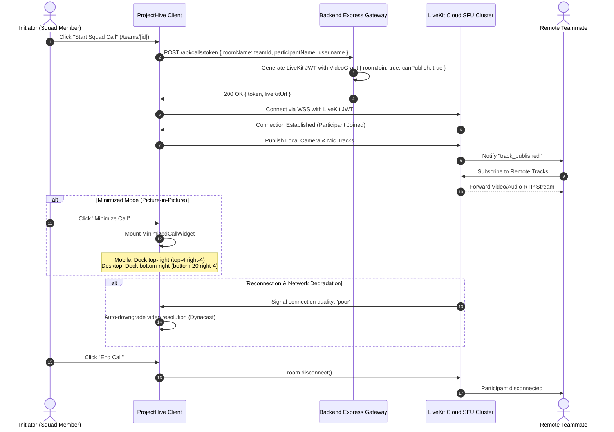
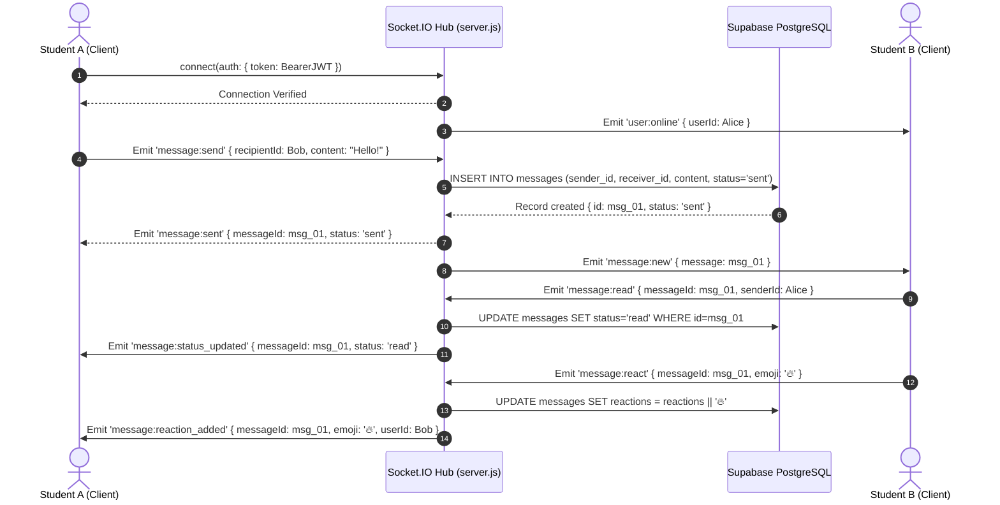
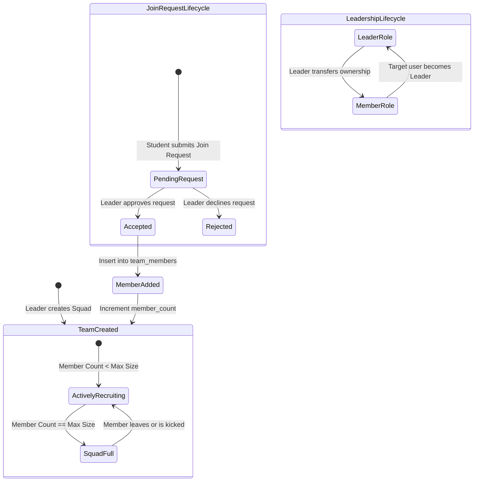
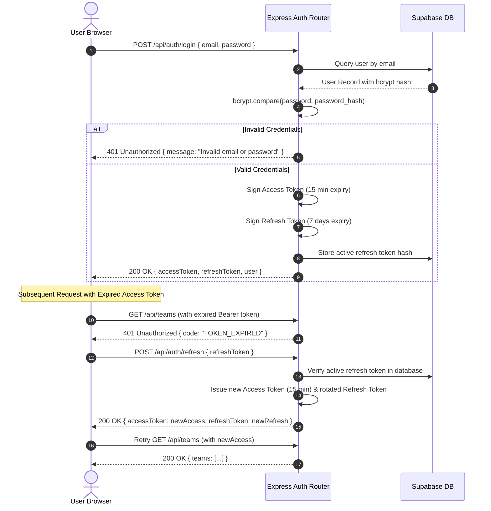

  

<h1 align="center">ProjectHive 🐝 — System Architecture & Technical Specifications</h1>

  <strong>Comprehensive Engineering Blueprints, Multi-Model Routing, LiveKit SFU Calling & Entity-Relationship Schemas</strong>

---

## 1. Master System Topology & Infrastructure Blueprint

ProjectHive implements a microservices-inspired monolithic edge architecture. Next.js 16 App Router handles the client tier and static pre-rendering on Vercel, while Node.js/Express and Socket.IO power the stateful real-time backend on Render. Persistent data resides in Supabase PostgreSQL, media streams are handled by LiveKit Cloud SFU, and AI reasoning is distributed across a 4-tier cascading model pool.

---

## 2. Database Entity-Relationship Diagram (ERD)

The persistent database schema is hosted on Supabase (PostgreSQL), utilizing foreign key constraints, cascading deletions, and indexed lookups for fast retrieval across users, squads, messages, feed posts, tickets, and audit trails.

---

## 3. Multimodal AI Cascading Engine

The AI Copilot ("HiveMind AI") implements an intelligent 4-tier routing and failover cascade. It automatically prioritizes visual reasoning when images or diagrams are detected, and executes text and code synthesis through Groq with automated fallbacks.

---

## 4. LiveKit Cloud SFU Audio/Video Calling & PiP Docking

ProjectHive replaces legacy P2P mesh topologies with a high-performance **Selective Forwarding Unit (SFU)** cluster hosted on LiveKit Cloud. This enables multi-participant video calls with minimal client CPU and bandwidth overhead.

---

## 5. Real-Time Socket.IO Bi-directional Event Pipeline

The messaging system powers both direct messaging (`/messages`) and embedded squad channels (`/teams/[id]`). It supports optimistic UI updates, delivery status updates, and emoji reaction broadcasts.

---

## 6. Team Collaboration & Join Request State Machine

Squad workflows are modeled as a deterministic state machine to ensure member counts never exceed squad capacity and leadership is securely preserved.

---

## 7. Security, OWASP & Auth Token Lifecycle

ProjectHive maintains zero-trust security standards across all endpoints and browser sessions:

---

## 8. International Responsive Design System Standards

1. **Dynamic Viewport Height (`100dvh`)**: All full-screen viewports enforce `min-height: 100dvh` in `globals.css` and template containers to prevent layout jumps when mobile address bars expand or collapse.
2. **iOS Safari Auto-Zoom Prevention**: Form text inputs enforce `text-base sm:text-sm` (minimum 16px computed font size on mobile viewports) to prevent browser auto-zooming on focus.
3. **WCAG 2.1 AAA Touch Targets**: All interactive elements (navigation buttons, dropdown toggles, modal closures, and action pills) enforce a strict minimum boundary of `44x44px` (`.touch-target`).
4. **Dual Presentation Data Layouts**:
   - Desktop (`>= 768px`): High-density tabular views (`hidden md:block`).
   - Mobile (`< 768px`): Zero-horizontal-scroll stacked card views (`md:hidden`) with hardware, network, and contextual actions.
5. **Zero Cumulative Layout Shift (CLS)**: Skeletons (`.skeleton-shimmer`) match the exact pixel dimensions of resolved data components, eliminating page jumpiness during async fetching.

---

## 📜 License

This architecture and codebase are licensed under the **[MIT License](LICENSE)**.

Copyright (c) 2025-2026 ProjectHive Contributors.
