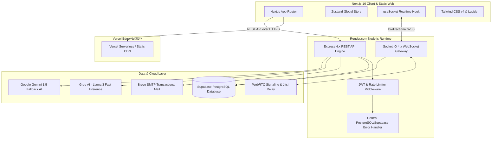
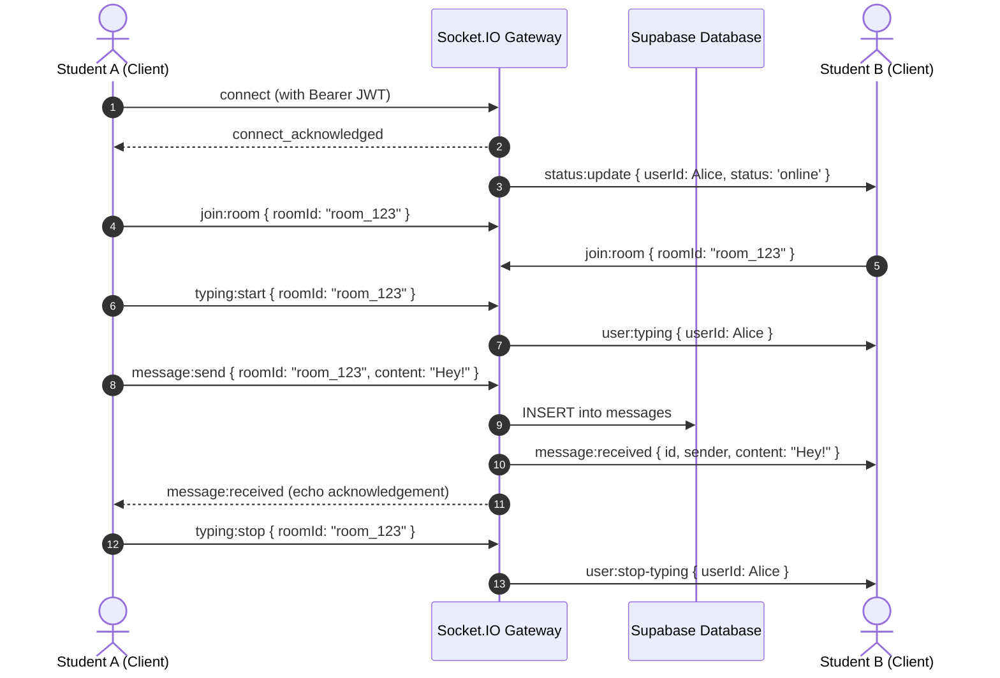
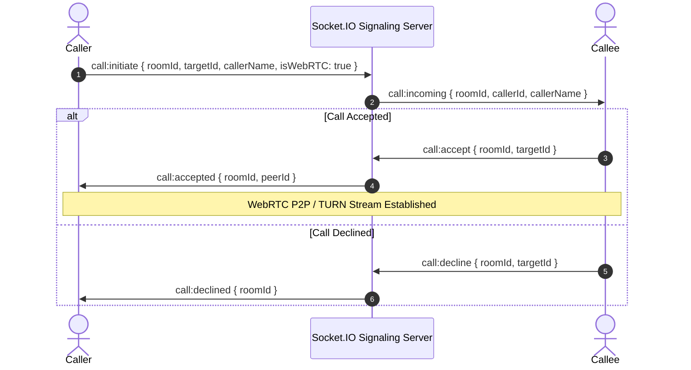
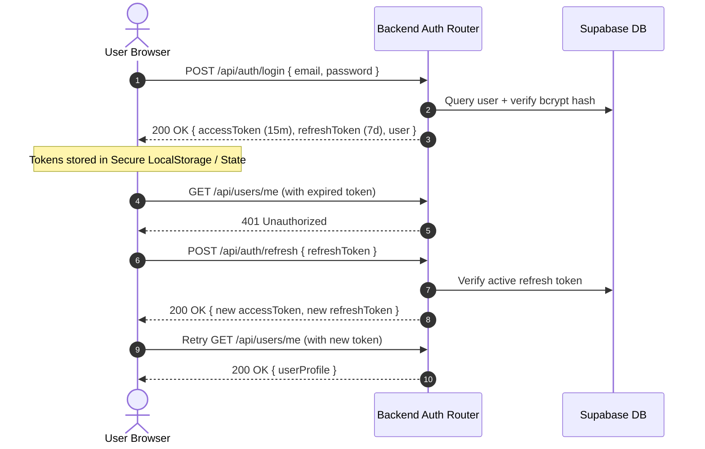

# ProjectHive 🐝 — System Architecture & Technical Specifications

> High-Performance Student Collaboration, Real-Time Networking, and Project Incubation Platform.

---

## 1. High-Level Architecture Overview

---

## 2. Real-Time WebSocket Communication Flow

---

## 3. WebRTC Voice & Video Signaling Sequence

---

## 4. Authentication & Token Refresh Flow

---

## 5. Security & International Compliance Standards

1. **OWASP Top 10 Protections**:
   - **XSS Prevention**: DOMPurify and custom input sanitization on all user-submitted markdown and message bodies.
   - **CSRF & Injection**: Strict CORS origin regex filters (`*.vercel.app` & explicit localhost) and parameterized SQL queries via Supabase JS client.
   - **Rate Limiting**: `express-rate-limit` protecting auth endpoints (20 req / 15 min) and global endpoints (100 req / 15 min).
2. **WCAG 2.1 Accessibility**:
   - Semantic HTML5 landmarks (`<aside>`, `<main>`, `<header>`, `<nav>`).
   - High-contrast color ratios complying with AA standard in both Light and Dark modes.
   - Fully keyboard-accessible navigation and ARIA attributes for screen readers.
3. **Data Integrity & Privacy**:
   - Passwords salted and hashed with **bcryptjs (cost factor 10)**.
   - Stateless JWT tokens signed with SHA-256 HMAC secrets.
   - Graceful server shutdown hooks ensuring database pool cleanup.

