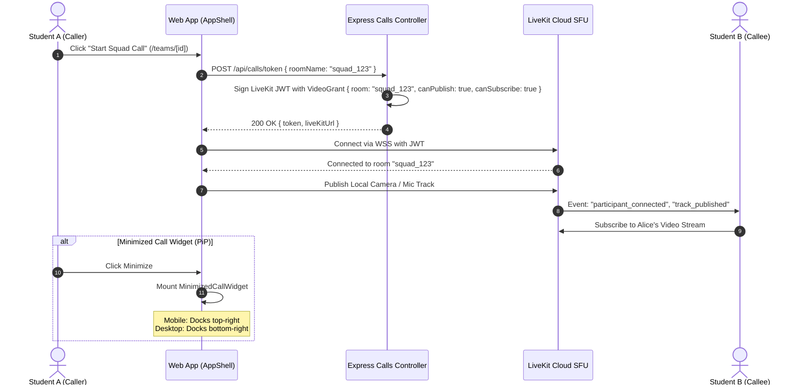

<p align="center">
  
</p>

<h1 align="center">ProjectHive 🐝 — LiveKit Real-Time Media Architecture & Deployment</h1>

<p align="center">
  <strong>Comprehensive Configuration for LiveKit Cloud SFU & Self-Hosted WebRTC Infrastructure</strong>
</p>

---

## 1. System Architecture Blueprint

ProjectHive replaces legacy P2P mesh architectures with an enterprise **Selective Forwarding Unit (SFU)**. The backend issues short-lived, cryptographically signed JWT tokens, and clients stream video/audio tracks directly to the SFU with adaptive simulcast downscaling.

```mermaid
graph TD
    Client["ProjectHive Client (Next.js 16 App Router)"]
    Backend["Backend Express Gateway (Render.com)"]
    LiveKitSFU["LiveKit Cloud SFU (wss://project-hive-o0q9p17e.livekit.cloud)"]
    TURN["Coturn / Metered.ca (Symmetric NAT Relay)"]

    Client -->|"1. POST /api/calls/token (roomName, user)"| Backend
    Backend -->|"2. Mint VideoGrant JWT"| Backend
    Backend -->>|"3. Return { token, liveKitUrl }"| Client
    Client <-->|"4. WebRTC WSS Signaling & Dynacast"| LiveKitSFU
    LiveKitSFU -.->|"Fallback on strict firewall"| TURN
    Client <-->|"5. Video / Audio RTP Tracks"| LiveKitSFU
```

---

## 2. Real-Time Token Generation & Media Lifecycle



---

## 3. Cloud Deployment (Free Tier Cloud Setup)

ProjectHive is natively pre-configured for **LiveKit Cloud**:

### Step 1: Obtain Cloud Credentials
1. Register at [cloud.livekit.io](https://cloud.livekit.io).
2. Create a project named `Project-Hive`.
3. Generate an API Key and Secret in **Settings** → **Keys**.

### Step 2: Configure Environment Variables

**Backend (`server/.env`)**:
```env
LIVEKIT_URL=wss://project-hive-o0q9p17e.livekit.cloud
LIVEKIT_API_KEY=your_api_key
LIVEKIT_API_SECRET=your_api_secret
```

**Frontend (`frontend/.env.local`)**:
```env
NEXT_PUBLIC_API_URL=https://projecthive-backend.onrender.com/api
NEXT_PUBLIC_SOCKET_URL=https://projecthive-backend.onrender.com
NEXT_PUBLIC_LIVEKIT_URL=wss://project-hive-o0q9p17e.livekit.cloud
```

---

## 4. Self-Hosted Deployment (Docker / Local Development)

For offline development or self-hosting on a custom VPS, run LiveKit using Docker:

### Quick Run with Docker
```bash
docker run --rm \
  -p 7880:7880 \
  -p 7881:7881 \
  -p 7882:7882/udp \
  livekit/livekit-server \
  --dev
```

### Local Environment Variables
```env
# Backend
LIVEKIT_URL=ws://127.0.0.1:7880
LIVEKIT_API_KEY=devkey
LIVEKIT_API_SECRET=secret

# Frontend
NEXT_PUBLIC_LIVEKIT_URL=ws://127.0.0.1:7880
```

---

## 5. Troubleshooting & Diagnostics

| Symptom | Probable Cause | Resolution |
|---|---|---|
| `Token has expired or is invalid` | System clock drift or wrong API secret | Verify `LIVEKIT_API_SECRET` matches between `.env` and LiveKit console. |
| `Cannot publish audio/video` | Browser camera/mic permissions blocked | Verify browser site settings allow media device access. |
| `Call disconnects on strict Wi-Fi` | Symmetric NAT / Enterprise UDP blocking | Configure `METERED_API_KEY` or custom Coturn TURN relay in `server/.env`. |

---

## 📜 License

This setup guide is open-source software licensed under the **[MIT License](LICENSE)**.

Copyright (c) 2025-2026 ProjectHive Contributors.
