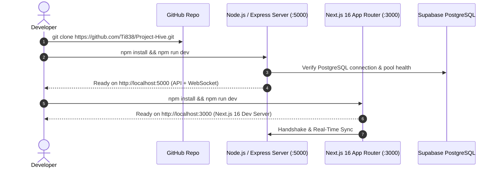

<p align="center">
  
</p>

<h1 align="center">ProjectHive 🐝 — Developer Quick Start Guide</h1>

<p align="center">
  <strong>Complete Local Setup & Development Environment Guide for Next.js 16 + Node.js</strong>
</p>

---

## 1. Fast Track Startup Sequence



---

## 2. Step-by-Step Local Setup

### Step 1: Clone the Repository
```bash
git clone https://github.com/Ti838/Project-Hive.git
cd Project-Hive
```

### Step 2: Configure the Backend Server
```bash
cd server
npm install
cp .env.example .env
```

Open `server/.env` and ensure the following keys are populated:
```env
PORT=5000
NODE_ENV=development

# Supabase PostgreSQL
SUPABASE_URL=https://your-project.supabase.co
SUPABASE_ANON_KEY=your_anon_key
SUPABASE_SERVICE_ROLE_KEY=your_service_role_key

# JWT Token Secret
JWT_SECRET=your_super_secret_jwt_key_here

# Free Tier AI Keys
GROQ_API_KEY=gsk_...
GEMINI_API_KEY=AIzaSy...
OPENROUTER_API_KEY=sk-or-v1-...

# LiveKit SFU Calling
LIVEKIT_URL=wss://project-hive-o0q9p17e.livekit.cloud
LIVEKIT_API_KEY=your_livekit_key
LIVEKIT_API_SECRET=your_livekit_secret

# Default Admin Account
ADMIN_EMAIL=admin@projecthive.com
ADMIN_PASSWORD=AdminPassword123!
```

Start the backend:
```bash
npm run dev
```
*Backend API and WebSocket gateway will listen on **`http://localhost:5000`**.*

---

### Step 3: Configure the Next.js Frontend
In a new terminal window:
```bash
cd frontend
npm install
cp .env.example .env.local
```

Verify your `frontend/.env.local`:
```env
NEXT_PUBLIC_API_URL=http://localhost:5000/api
NEXT_PUBLIC_SOCKET_URL=http://localhost:5000
NEXT_PUBLIC_LIVEKIT_URL=wss://project-hive-o0q9p17e.livekit.cloud
```

Start the Next.js development server:
```bash
npm run dev
```
*Frontend will launch at **`http://localhost:3000`** with Turbopack and React 19 fast refresh enabled.*

---

## 3. Production App Router Navigation Matrix

| Route | Page / Workspace | Access Control |
|---|---|---|
| `/` | Marketing Landing Page | Public |
| `/login` | Responsive User Sign In | Public |
| `/register` | Student Onboarding & University Affiliation | Public |
| `/dashboard` | Student Dashboard & Activity Feed | Authenticated |
| `/feed` | Community Posts, Polls & Media Feed | Authenticated |
| `/teams` | Squad & Teammate Discovery Hub | Authenticated |
| `/teams/[id]` | Discord-Grade Dedicated Squad Workspace | Authenticated |
| `/teams/create` | Squad Creation Studio | Authenticated |
| `/messages` | WhatsApp-Grade Real-Time Messaging | Authenticated |
| `/projects` | Showcase Capstone Portfolio | Authenticated |
| `/generator` | AI Project Proposal Studio | Authenticated |
| `/profile` | User Profile & Skill Matrix | Authenticated |
| `/settings` | Account Security & Preferences | Authenticated |
| `/admin/login` | Enterprise Administrator Sign In | Role-gated |
| `/admin/dashboard` | Enterprise Telemetry & Governance Console | Role-gated (`role: admin`) |

---

## 4. Verification & Testing Commands

To verify that all TypeScript types, Next.js page generation, and Tailwind styles compile cleanly for production:
```bash
npm --prefix frontend run build
```
Expected output:
```text
✓ Compiled successfully
✓ Generating static pages (27/27) in 2.7s
Exit code: 0
```

---

## 📜 License

This project is open-source software licensed under the **[MIT License](LICENSE)**.

Copyright (c) 2025-2026 ProjectHive Contributors.
