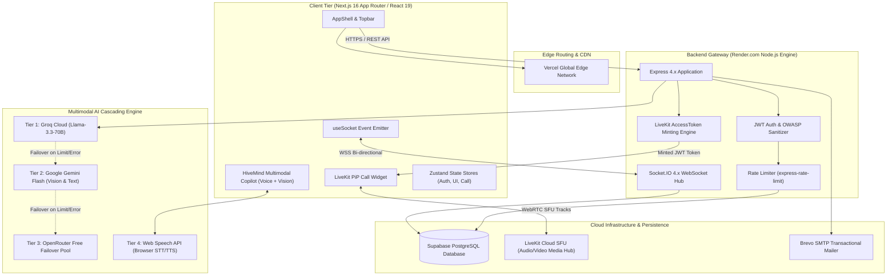

<p align="center">
  
</p>

<h1 align="center">ProjectHive </h1>

<p align="center">
  <strong>The Next-Generation Collaboration, Teammate Discovery & Project Incubation Platform for Universities</strong>
</p>

<p align="center">
  <a href="https://projecthive-bd.vercel.app"></a>
  <a href="https://react.dev"></a>
  <a href="https://projecthive-backend.onrender.com"></a>
  <a href="https://supabase.com"></a>
  <a href="https://socket.io"></a>
  <a href="https://livekit.io"></a>
  <a href="https://groq.com"></a>
  <a href="LICENSE"></a>
</p>

---

## 🌟 Executive Overview

**ProjectHive** is a production-grade collaborative ecosystem connecting university developers, designers, and innovators. Built to the interaction and resilience standards of Discord, WhatsApp, Messenger, and GitHub, ProjectHive integrates:
- **Multimodal AI Copilot ("HiveMind AI")**: 4-tier cascading intelligence (Groq Llama 3.3 70B, Google Gemini 2.5 Flash, OpenRouter Free, and Browser Native Web Speech API for real-time speech dictation and voice readback).
- **Enterprise Audio/Video Calling**: Low-latency SFU group calling powered by **LiveKit Cloud** with adaptive bitrate streaming and an interactive Picture-in-Picture (PiP) Minimized Call Widget.
- **Discord-Grade Team Workspaces (`/teams/[id]`)**: Interactive roster management, squad group chat over Socket.IO, recruitment indicators, applicant approval drawers, and leadership delegation.
- **WhatsApp-Grade Real-Time Messaging (`/messages`)**: Full message delivery receipts (`sent` / `delivered` / `read`), emoji reactions, instant clipboard image pasting, and presence indicators.
- **Ultra-Responsive International Design System**: Zero Cumulative Layout Shift (CLS), strict dynamic viewport height bounds (`100dvh`), iOS Safari auto-zoom prevention (`text-base sm:text-sm`), and WCAG 2.1 AAA 44x44px touch targets.
- **Enterprise Admin Control Center (`/admin/dashboard`)**: Dual desktop/mobile views, real-time node telemetry, instant user governance, feed moderation, support ticketing, and persistent audit trail logging.

---

## 🌐 Live Production Deployments

| Service | Environment | Live URL | Purpose |
|---|---|---|---|
| 🌐 **Student Web Platform** | Production | [https://projecthive-bd.vercel.app](https://projecthive-bd.vercel.app) | Next.js 16 App Router interface |
| 👑 **Enterprise Admin Portal** | Production | [https://projecthive-bd.vercel.app/admin/login](https://projecthive-bd.vercel.app/admin/login) | Role-gated administration console |
| ⚙️ **Backend API Gateway** | Production | [https://projecthive-backend.onrender.com/api](https://projecthive-backend.onrender.com/api) | Express REST API Engine |
| 🔌 **Real-Time WebSocket Gateway** | Production | `wss://projecthive-backend.onrender.com` | Socket.IO bi-directional cluster |
| 🎙️ **LiveKit SFU Signaling** | Cloud | `wss://project-hive-o0q9p17e.livekit.cloud` | Selective Forwarding Unit media cluster |

---

## 📐 System Architecture Diagram



---

## ⚡ Core Feature Modules

### 1. 🤖 HiveMind Multimodal AI Copilot
- **Cascading Zero-Downtime Resilience**:
  - Automatically queries **Groq Cloud** (`llama-3.3-70b-versatile` / `qwen/qwen-2.5-32b`) for sub-second responses.
  - Automatically routes image uploads and screenshot pastes to **Google Gemini** (`gemini-2.5-flash` / `gemini-2.0-flash`).
  - Seamlessly fails over to **OpenRouter Free Tier** (`meta-llama/llama-3.3-70b-instruct:free`, `google/gemini-2.0-flash-lite-preview:free`) if API rate limits or quota drops occur.
- **Two-Way Voice Engine**: Hands-free voice dictation via `webkitSpeechRecognition` and natural-language voice feedback via `speechSynthesis`.
- **Engineering Toolset**: Code debugging, system architecture synthesis, database schema creation, and hackathon project pitch polishing.
- **Adaptive Docking**: Automatically transforms between an 88dvh bottom slide-up sheet on mobile and a docked card on desktop.

### 2. 🎙️ Enterprise LiveKit SFU Video & Audio Calling
- Powered by official **LiveKit Cloud SFU** infrastructure with WebRTC P2P fallback.
- **Adaptive Bitrate Streaming**: Smooth dynamic video downscaling based on real-time network conditions.
- **Picture-in-Picture (PiP) Docking**: Minimized video widget dynamically docks top-right on mobile (< 640px) to prevent bottom navigation collisions, and bottom-right on desktop.
- Full microphone mute, camera toggle, screen sharing, active speaker detection, and call termination actions.

### 3. 👥 Discord-Grade Team Workspace (`/teams/[id]`)
- **Hero Hub**: Squad banner, category pill, hiring status indicator (`🟢 Actively Recruiting` / `🔴 Squad Full`), leader profile card, and instant "Start Squad Call" action.
- **Tab 1: Overview & Roster**: Interactive teammate cards with university affiliations, leader badges, member eviction, and instant leadership delegation.
- **Tab 2: Squad Group Chat**: Real-time group messaging scoped to the team's room, Ctrl+V image pasting, and native emoji reactions.
- **Tab 3: Settings & Join Requests**: Leader-only applicant approval drawer with one-click Accept/Reject controls.

### 4. 💬 WhatsApp-Grade Real-Time Messaging (`/messages`)
- Direct 1-on-1 and multi-user chat channels powered by Socket.IO.
- **Delivery Receipts**: Accurate message status tracking (`🕒 Sending` → `✓ Sent` → `✓✓ Delivered` → `✓✓ Read`).
- **Emoji Reactions**: Interactive floating emoji bar with live aggregation.
- **Instant Media Uploads**: Paste screenshots directly from the clipboard (`Ctrl+V`).

### 5. 👑 Enterprise Admin Control Center (`/admin/dashboard`)
- **Dual Presentation**: Responsive data tables on desktop (`hidden md:block`) and zero-horizontal-scroll stacked cards on mobile (`md:hidden`).
- **Telemetry**: Live node metrics, message volume, database cluster ping, and server health.
- **User Governance**: One-click ban/unban controls, role elevation (`student` ↔ `admin`), and account deletion.
- **Content Moderation & Support**: Scan community posts, audit uploaded media attachments, and resolve helpdesk tickets.
- **Platform Kill-Switches**: One-click toggles for Maintenance Mode, Student Registration, and Mandatory Email Verification.
- **Audit Logs**: Terminal-style live stream of immutable administrative events.

---

## 🗂️ Codebase Organization

```text
Project-Hive/
├── frontend/                               # Modern Next.js 16 App Router Frontend
│   ├── public/                             # Static assets, logos, and manifests
│   │   ├── logo.png                        # Primary ProjectHive Brand Logo
│   │   ├── bee-logo.png                    # Brand Mascot Icon
│   │   └── manifest.json                   # Web Application Manifest
│   ├── src/
│   │   ├── app/                            # 27 Prerendered & Dynamic Routes
│   │   │   ├── (app)/                      # Authenticated Shell (Dashboard, Feed, Teams, Messages)
│   │   │   ├── admin/                      # Admin Login & Management Dashboard
│   │   │   ├── login/                      # Responsive Student Sign In
│   │   │   ├── register/                   # Responsive Student Onboarding
│   │   │   ├── globals.css                 # 100dvh Guards, Touch-Targets, Theme Tokens
│   │   │   └── layout.tsx                  # Root HTML shell & metadata
│   │   ├── components/                     # Component Library
│   │   │   ├── ai/HiveMindCopilot.tsx      # Multimodal AI Copilot (Voice, Vision, Code)
│   │   │   ├── calling/                    # LiveKit SFU Call Overlays & PiP Widget
│   │   │   ├── layout/                     # AppShell, Sidebar, Topbar, MobileNav
│   │   │   └── ui/                         # Atomic primitives (Buttons, Inputs, Badges)
│   │   ├── hooks/                          # Custom Hooks (useSocket, useLiveKitRoom, useAuth)
│   │   └── lib/                            # Typed API Client, Zustand Stores, Voice Engine
│   └── package.json
│
├── server/                                 # Node.js + Express 4.x Backend Engine
│   ├── config/                             # Supabase, Groq, Gemini & OpenRouter AI clients
│   ├── controllers/                        # Business Logic (Auth, Teams, Chat, Calls, AI, Admin)
│   ├── database/                           # Schema definitions & migrations
│   │   └── schema.sql                      # PostgreSQL tables, indexes, triggers, and RLS
│   ├── middleware/                         # JWT Verification, Rate Limiting, OWASP Top 10 Guards
│   ├── routes/                             # Express REST API Route Endpoints
│   ├── services/                           # Socket.IO Event Handlers & Brevo SMTP Service
│   ├── app.js                              # Express Setup, CORS, Security Headers
│   ├── server.js                           # Node.js HTTP & WebSocket Server Entry Point
│   └── package.json
│
├── ARCHITECTURE.md                         # Deep Technical Blueprint & 7 Mermaid Diagrams
├── API_DOCUMENTATION.md                    # Complete REST API & Socket.IO Reference
├── LIVEKIT_SETUP.md                        # Step-by-Step LiveKit Cloud SFU Setup Guide
├── QUICKSTART.md                           # Local Development Quickstart Guide
├── LICENSE                                 # MIT Open-Source License
└── README.md                               # Primary Project Documentation
```

---

## 🛠️ Local Development & Quick Start

### Prerequisites
- **Node.js**: v18.17.0 or higher
- **npm**: v9.0.0 or higher
- **Supabase Account**: (Free tier PostgreSQL database)
- **LiveKit Cloud Account**: (Free tier SFU for video/audio calling)
- **Groq / Google Gemini / OpenRouter API Keys**: (Free tier AI inference)

### 1. Clone Repository
```bash
git clone https://github.com/Ti838/Project-Hive.git
cd Project-Hive
```

### 2. Backend Setup
```bash
cd server
npm install
cp .env.example .env
# Fill in your SUPABASE_URL, SUPABASE_SERVICE_ROLE_KEY, JWT_SECRET, GROQ_API_KEY, GEMINI_API_KEY
npm run dev
```
*Backend runs on `http://localhost:5000`.*

### 3. Frontend Setup
```bash
cd ../frontend
npm install
cp .env.example .env.local
# Set NEXT_PUBLIC_API_URL=http://localhost:5000/api
# Set NEXT_PUBLIC_SOCKET_URL=http://localhost:5000
# Set NEXT_PUBLIC_LIVEKIT_URL=wss://your-project.livekit.cloud
npm run dev
```
*Frontend runs on `http://localhost:3000`.*

### 4. Production Build Verification
```bash
npm --prefix frontend run build
```
*Compiles all 27 routes with zero TypeScript or Next.js errors.*

---

## 📜 License

This project is open-source software licensed under the **[MIT License](LICENSE)**.

Copyright (c) 2025-2026 ProjectHive Contributors.
