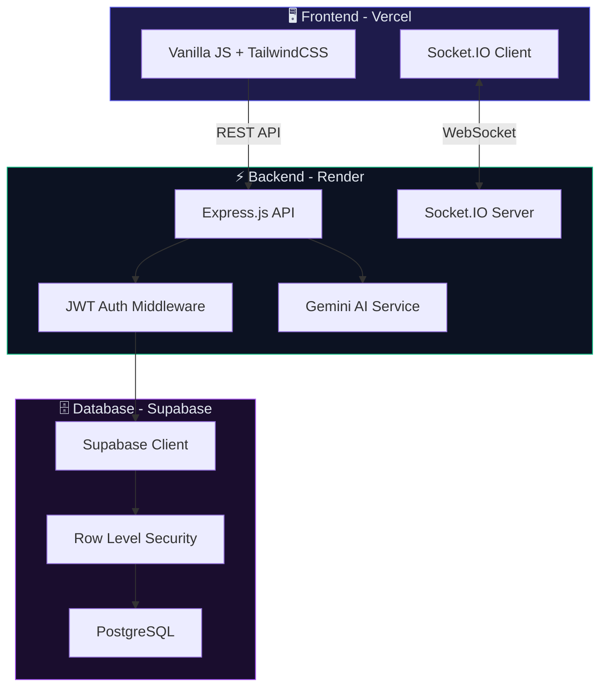
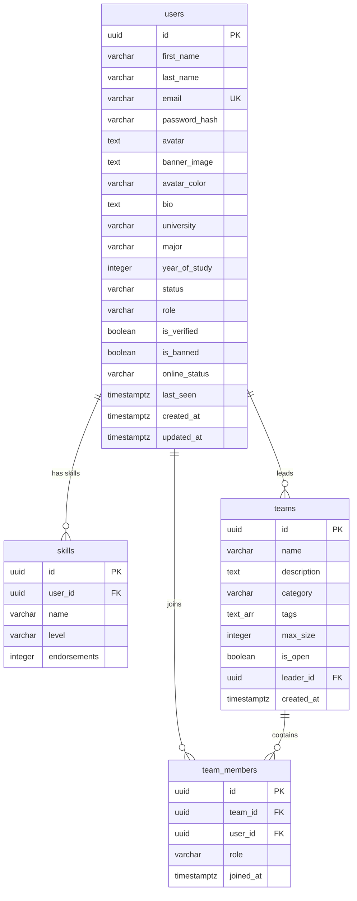
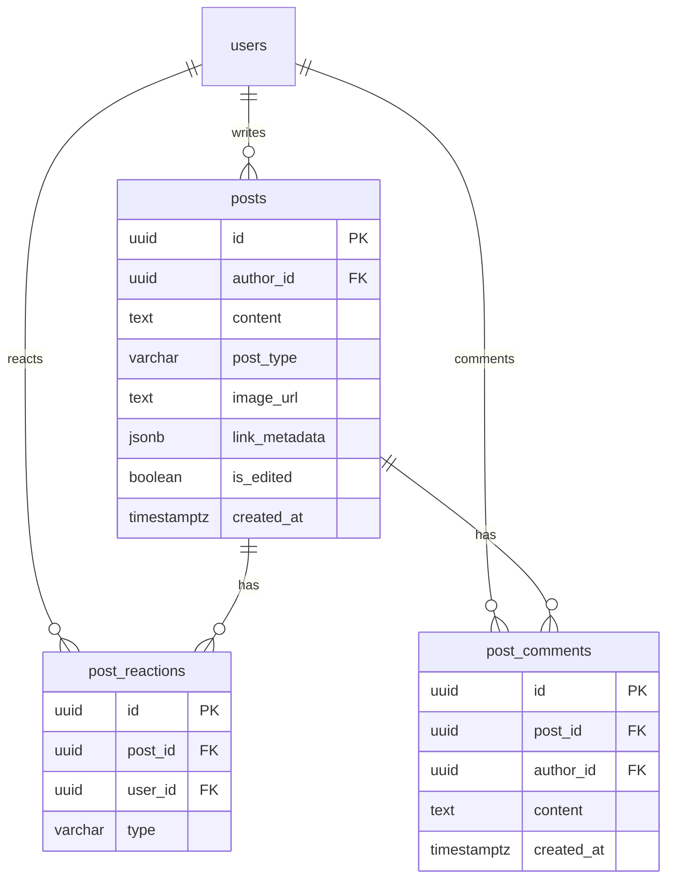
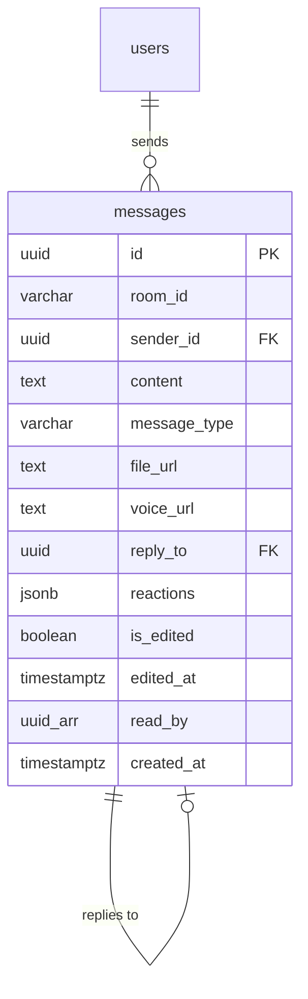
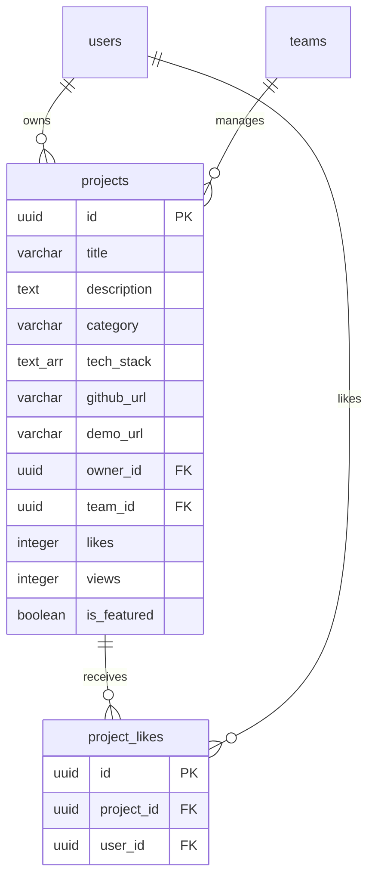
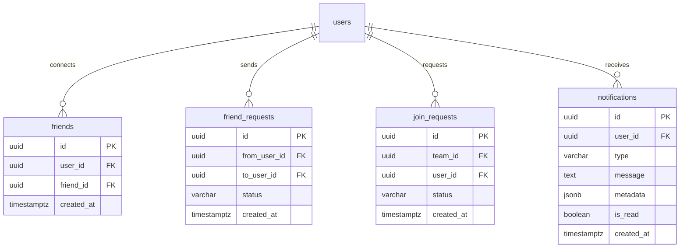
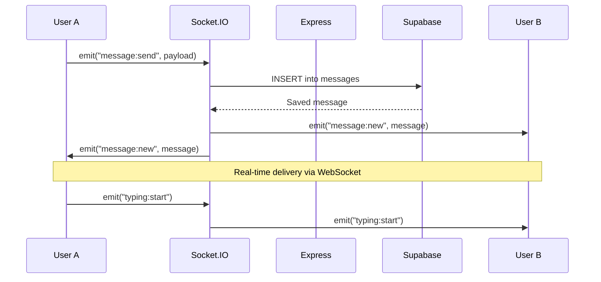
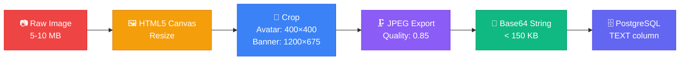

# ProjectHive — Database Architecture

> **Database:** Supabase PostgreSQL | **Tables:** 13 | **Relations:** 18 Foreign Keys  
> **Security:** Row Level Security (RLS) on all tables | **Last Updated:** June 24, 2026

---

## System Architecture Overview



---

## Entity Relationship Diagram

### Core Entities



### Social & Content



### Messaging System



### Projects & Showcase



### Networking & Notifications



---

## Data Flow Diagrams

### Authentication Flow

```mermaid
sequenceDiagram
    participant C as Client
    participant S as Express API
    participant DB as Supabase
    participant G as Google OAuth

    rect rgb(30, 27, 75)
        Note over C,DB: Email/Password Login
        C->>S: POST /api/auth/login
        S->>DB: Query users by email
        DB-->>S: User record
        S->>S: bcrypt.compare(password)
        S-->>C: { accessToken, refreshToken }
    end

    rect rgb(12, 18, 34)
        Note over C,G: Google OAuth Login
        C->>G: Supabase OAuth redirect
        G-->>C: Authorization code
        C->>S: POST /api/auth/google/callback
        S->>DB: Upsert user by email
        S-->>C: { accessToken, refreshToken }
    end
```



### Message Delivery Flow



### Feed & Poll Voting Flow

```mermaid
sequenceDiagram
    participant U as User
    participant API as Express
    participant DB as Supabase

    rect rgb(30, 27, 75)
        Note over U,DB: Create Poll Post
        U->>API: POST /api/posts { type: "poll", link_metadata: { options } }
        API->>DB: INSERT into posts
        DB-->>API: Post with poll data
        API-->>U: 201 Created
    end

    rect rgb(12, 18, 34)
        Note over U,DB: Vote on Poll
        U->>API: POST /api/posts/:id/vote { option: "Option A" }
        API->>DB: SELECT link_metadata FROM posts
        API->>API: Toggle vote in JSONB options array
        API->>DB: UPDATE posts SET link_metadata
        DB-->>API: Updated post
        API-->>U: { updatedPoll }
    end
```



---

## Table Schemas

### 1. `users` — Core Identity

The central table. All other entities reference users.

| Column | Type | Constraints | Description |
|--------|------|-------------|-------------|
| `id` | UUID | PK, Default: `gen_random_uuid()` | Unique identifier |
| `first_name` | VARCHAR(100) | NOT NULL | First name |
| `last_name` | VARCHAR(100) | NOT NULL | Last name |
| `email` | VARCHAR(255) | UNIQUE, NOT NULL | Login email |
| `password_hash` | VARCHAR(255) | NOT NULL | bcrypt hash |
| `avatar` | TEXT | — | Base64 profile image (≤150KB) |
| `banner_image` | TEXT | — | Base64 banner (≤150KB) |
| `avatar_color` | VARCHAR(20) | Default: `#6366F1` | Fallback avatar background |
| `bio` | TEXT | Default: `''` | User biography |
| `university` | VARCHAR(255) | Default: `''` | University name |
| `major` | VARCHAR(255) | Default: `''` | Field of study |
| `year_of_study` | INTEGER | — | Academic year |
| `status` | VARCHAR(20) | Default: `'available'` | `available`, `busy`, `away` |
| `role` | VARCHAR(20) | Default: `'student'` | `student` or `admin` |
| `is_verified` | BOOLEAN | Default: `FALSE` | Email verified |
| `is_banned` | BOOLEAN | Default: `FALSE` | Account banned |
| `online_status` | VARCHAR(20) | Default: `'offline'` | `online`, `offline` |
| `last_seen` | TIMESTAMPTZ | Default: `now()` | Last active time |
| `created_at` | TIMESTAMPTZ | Default: `now()` | Registration date |
| `updated_at` | TIMESTAMPTZ | Default: `now()` | Last profile update |

### 2. `skills` — User Expertise

| Column | Type | Constraints | Description |
|--------|------|-------------|-------------|
| `id` | UUID | PK | — |
| `user_id` | UUID | FK → `users.id` CASCADE | Skill owner |
| `name` | VARCHAR(100) | NOT NULL | Skill name (e.g. "React") |
| `level` | VARCHAR(20) | Default: `'intermediate'` | `beginner`, `intermediate`, `advanced` |
| `endorsements` | INTEGER | Default: `0` | Times endorsed by others |

### 3. `teams` — Collaboration Groups

| Column | Type | Constraints | Description |
|--------|------|-------------|-------------|
| `id` | UUID | PK | — |
| `name` | VARCHAR(255) | NOT NULL | Team name |
| `description` | TEXT | — | Team description |
| `category` | VARCHAR(100) | — | e.g. "Web Dev", "AI/ML" |
| `tags` | TEXT[] | — | Skill/topic tags |
| `max_size` | INTEGER | Default: `5` | Maximum members |
| `is_open` | BOOLEAN | Default: `TRUE` | Open for joining |
| `leader_id` | UUID | FK → `users.id` CASCADE | Team creator/leader |
| `created_at` | TIMESTAMPTZ | Default: `now()` | — |

### 4. `team_members` — Junction Table

| Column | Type | Constraints | Description |
|--------|------|-------------|-------------|
| `id` | UUID | PK | — |
| `team_id` | UUID | FK → `teams.id` CASCADE | — |
| `user_id` | UUID | FK → `users.id` CASCADE | — |
| `role` | VARCHAR(20) | Default: `'member'` | `leader` or `member` |
| `joined_at` | TIMESTAMPTZ | Default: `now()` | — |
| — | — | UNIQUE(`team_id`, `user_id`) | No duplicate memberships |

### 5. `projects` — Showcase Portfolio

| Column | Type | Constraints | Description |
|--------|------|-------------|-------------|
| `id` | UUID | PK | — |
| `title` | VARCHAR(255) | NOT NULL | Project title |
| `description` | TEXT | — | Full description |
| `category` | VARCHAR(100) | — | Project category |
| `tech_stack` | TEXT[] | — | Technologies used |
| `github_url` | VARCHAR(500) | — | GitHub repository link |
| `demo_url` | VARCHAR(500) | — | Live demo link |
| `owner_id` | UUID | FK → `users.id` CASCADE | Project owner |
| `team_id` | UUID | FK → `teams.id` SET NULL | Associated team |
| `likes` | INTEGER | Default: `0` | Upvote count |
| `views` | INTEGER | Default: `0` | View count |
| `is_featured` | BOOLEAN | Default: `FALSE` | Admin-featured flag |

### 6. `messages` — Real-time Messaging

| Column | Type | Constraints | Description |
|--------|------|-------------|-------------|
| `id` | UUID | PK | — |
| `room_id` | VARCHAR(255) | NOT NULL | DM: `userA_userB` (sorted), Team: `teamId` |
| `sender_id` | UUID | FK → `users.id` CASCADE | Message author |
| `content` | TEXT | NOT NULL | Message body |
| `message_type` | VARCHAR(20) | Default: `'text'` | `text`, `voice`, `image` |
| `file_url` | TEXT | — | Image attachment URL |
| `voice_url` | TEXT | — | Base64 voice data |
| `reply_to` | UUID | FK → `messages.id` | Quoted message reference |
| `reactions` | JSONB | Default: `'{}'` | `{ "👍": ["uid1"], "❤️": ["uid2"] }` |
| `is_edited` | BOOLEAN | Default: `FALSE` | Edited flag |
| `edited_at` | TIMESTAMPTZ | — | Last edit timestamp |
| `read_by` | UUID[] | — | Array of user IDs who read |
| `created_at` | TIMESTAMPTZ | Default: `now()` | — |

### 7. `friends` — Mutual Connections

| Column | Type | Constraints | Description |
|--------|------|-------------|-------------|
| `id` | UUID | PK | — |
| `user_id` | UUID | FK → `users.id` CASCADE | User A |
| `friend_id` | UUID | FK → `users.id` CASCADE | User B |
| `created_at` | TIMESTAMPTZ | Default: `now()` | — |

### 8. `friend_requests` — Pending Connections

| Column | Type | Constraints | Description |
|--------|------|-------------|-------------|
| `id` | UUID | PK | — |
| `from_user_id` | UUID | FK → `users.id` CASCADE | Sender |
| `to_user_id` | UUID | FK → `users.id` CASCADE | Recipient |
| `status` | VARCHAR(20) | Default: `'pending'` | `pending`, `accepted`, `rejected` |
| `created_at` | TIMESTAMPTZ | Default: `now()` | — |

### 9. `posts` — Social Feed

| Column | Type | Constraints | Description |
|--------|------|-------------|-------------|
| `id` | UUID | PK | — |
| `author_id` | UUID | FK → `users.id` CASCADE | Post author |
| `content` | TEXT | NOT NULL | Post body |
| `post_type` | VARCHAR(30) | CHECK constraint | `general`, `achievement`, `project_update`, `looking_for_team`, `poll` |
| `image_url` | TEXT | — | Attached image |
| `link_metadata` | JSONB | — | URL previews or poll data |
| `is_edited` | BOOLEAN | Default: `FALSE` | Edited flag |
| `created_at` | TIMESTAMPTZ | Default: `now()` | — |

> **Poll JSONB Structure:**
> ```json
> {
>   "type": "poll",
>   "options": [
>     { "text": "React", "votes": ["user-uuid-1", "user-uuid-3"] },
>     { "text": "Vue", "votes": ["user-uuid-2"] },
>     { "text": "Svelte", "votes": [] }
>   ]
> }
> ```

### 10. `post_reactions` — Feed Reactions

| Column | Type | Constraints | Description |
|--------|------|-------------|-------------|
| `id` | UUID | PK | — |
| `post_id` | UUID | FK → `posts.id` CASCADE | — |
| `user_id` | UUID | FK → `users.id` CASCADE | — |
| `type` | VARCHAR(20) | CHECK constraint | `like`, `celebrate`, `insightful`, `support` |
| — | — | UNIQUE(`post_id`, `user_id`) | One reaction per user |

### 11. `post_comments` — Feed Comments

| Column | Type | Constraints | Description |
|--------|------|-------------|-------------|
| `id` | UUID | PK | — |
| `post_id` | UUID | FK → `posts.id` CASCADE | — |
| `author_id` | UUID | FK → `users.id` CASCADE | — |
| `content` | TEXT | NOT NULL | Comment body |
| `created_at` | TIMESTAMPTZ | Default: `now()` | — |

### 12. `notifications` — User Alerts

| Column | Type | Constraints | Description |
|--------|------|-------------|-------------|
| `id` | UUID | PK | — |
| `user_id` | UUID | FK → `users.id` CASCADE | Recipient |
| `type` | VARCHAR(50) | — | `friend_request`, `team_invite`, `reaction`, etc. |
| `message` | TEXT | — | Display text |
| `metadata` | JSONB | — | Extra context (sender info, links) |
| `is_read` | BOOLEAN | Default: `FALSE` | Read status |
| `created_at` | TIMESTAMPTZ | Default: `now()` | — |

### 13. `join_requests` — Team Join Flow

| Column | Type | Constraints | Description |
|--------|------|-------------|-------------|
| `id` | UUID | PK | — |
| `team_id` | UUID | FK → `teams.id` CASCADE | Target team |
| `user_id` | UUID | FK → `users.id` CASCADE | Requesting user |
| `status` | VARCHAR(20) | Default: `'pending'` | `pending`, `accepted`, `rejected` |
| `created_at` | TIMESTAMPTZ | Default: `now()` | — |

---

## Row Level Security (RLS)

All tables have **RLS enabled**. The backend uses the `service_role` client which bypasses RLS:

```sql
CREATE POLICY "service_role_all_[table]" ON [table]
  FOR ALL TO service_role
  USING (true) WITH CHECK (true);
```

Public read-only policies for unauthenticated feed browsing:

| Table | Policy | Access |
|-------|--------|--------|
| `posts` | `read posts` | SELECT for all |
| `post_reactions` | `read reactions` | SELECT for all |
| `post_comments` | `read comments` | SELECT for all |

---

## Performance Optimization

### Image Compression Pipeline



**Benefits:**
- **Fast queries** — Base64 payloads under 150KB keep buffer pool lean
- **No external storage** — No S3/Cloudflare buckets needed
- **No timeouts** — Small payloads avoid Supabase gateway limits
- **Instant load** — Profile images render without additional HTTP requests

---

## Index Strategy

| Table | Index | Type | Purpose |
|-------|-------|------|---------|
| `users` | `email` | UNIQUE B-tree | Login lookup |
| `users` | `role` | B-tree | Admin filtering |
| `messages` | `room_id` | B-tree | Conversation queries |
| `messages` | `created_at` | B-tree DESC | Message ordering |
| `posts` | `author_id` | B-tree | User's posts |
| `posts` | `created_at` | B-tree DESC | Feed ordering |
| `friends` | `(user_id, friend_id)` | Composite | Friendship lookup |
| `team_members` | `(team_id, user_id)` | UNIQUE Composite | No duplicates |
| `post_reactions` | `(post_id, user_id)` | UNIQUE Composite | One reaction per user |

---

*Generated for ProjectHive — Student Collaboration Platform*
