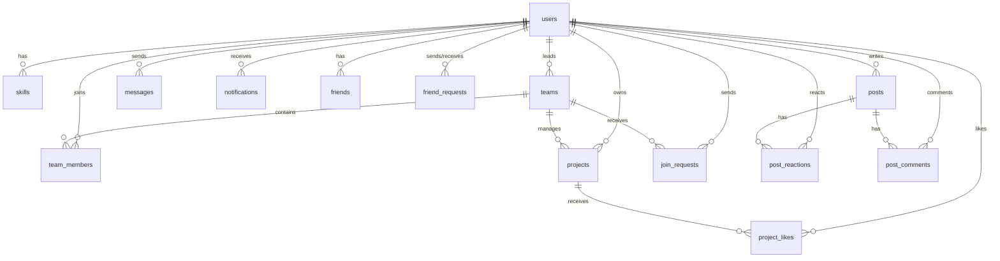

# ProjectHive — Database Design & Schema Reference 🗄️

This document describes the database design, tables, relations, and Row Level Security (RLS) policies implemented in ProjectHive. The project uses **Supabase PostgreSQL** as its primary relational database.

---

## 📊 Entity Relationship Diagram (ERD)

The diagram below shows the relationships between the main tables in ProjectHive:



---

## 🔑 Table Schemas

### 1. `users`
Stores student profile info, authentication records (hashes, verification tokens), and activity tracking statistics.
* **Fields:**
  * `id` (UUID, PK, Default: `gen_random_uuid()`)
  * `first_name` (VARCHAR(100), NOT NULL)
  * `last_name` (VARCHAR(100), NOT NULL)
  * `email` (VARCHAR(255), UNIQUE, NOT NULL)
  * `password_hash` (VARCHAR(255), NOT NULL)
  * `avatar` (TEXT)
  * `banner_image` (TEXT)
  * `avatar_color` (VARCHAR(20), Default: `#6366F1`)
  * `bio` (TEXT, Default: `''`)
  * `university` (VARCHAR(255), Default: `''`)
  * `major` (VARCHAR(255), Default: `''`)
  * `year_of_study` (INTEGER)
  * `status` (VARCHAR(20), Default: `'available'`)
  * `role` (VARCHAR(20), Default: `'student'`)
  * `is_verified` (BOOLEAN, Default: `FALSE`)
  * `is_banned` (BOOLEAN, Default: `FALSE`)
  * `online_status` (VARCHAR(20), Default: `'offline'`)
  * `last_seen` (TIMESTAMPTZ, Default: `now()`)
  * `created_at` (TIMESTAMPTZ, Default: `now()`)
  * `updated_at` (TIMESTAMPTZ, Default: `now()`)

### 2. `skills`
User professional skills used in search & recommendation.
* **Fields:**
  * `id` (UUID, PK)
  * `user_id` (UUID, FK -> `users.id` ON DELETE CASCADE)
  * `name` (VARCHAR(100), NOT NULL)
  * `level` (VARCHAR(20), Default: `'intermediate'`)
  * `endorsements` (INTEGER, Default: `0`)

### 3. `teams`
Project/study groups formed by students.
* **Fields:**
  * `id` (UUID, PK)
  * `name` (VARCHAR(255), NOT NULL)
  * `description` (TEXT)
  * `category` (VARCHAR(100))
  * `tags` (TEXT[] array)
  * `max_size` (INTEGER, Default: `5`)
  * `is_open` (BOOLEAN, Default: `TRUE`)
  * `leader_id` (UUID, FK -> `users.id` ON DELETE CASCADE)
  * `created_at` (TIMESTAMPTZ, Default: `now()`)

### 4. `team_members`
Junction table mapping users to teams.
* **Fields:**
  * `id` (UUID, PK)
  * `team_id` (UUID, FK -> `teams.id` ON DELETE CASCADE)
  * `user_id` (UUID, FK -> `users.id` ON DELETE CASCADE)
  * `role` (VARCHAR(20), Default: `'member'`)
  * `joined_at` (TIMESTAMPTZ, Default: `now()`)
  * *Constraint:* Unique `(team_id, user_id)`

### 5. `projects`
Showcase of finished or active student projects.
* **Fields:**
  * `id` (UUID, PK)
  * `title` (VARCHAR(255), NOT NULL)
  * `description` (TEXT)
  * `category` (VARCHAR(100))
  * `tech_stack` (TEXT[] array)
  * `github_url` (VARCHAR(500))
  * `demo_url` (VARCHAR(500))
  * `owner_id` (UUID, FK -> `users.id` ON DELETE CASCADE)
  * `team_id` (UUID, FK -> `teams.id` ON DELETE SET NULL)
  * `likes` (INTEGER, Default: `0`)
  * `views` (INTEGER, Default: `0`)

### 6. `messages`
Stores direct messages (DMs) between users and team group messages.
* **Fields:**
  * `id` (UUID, PK)
  * `room_id` (VARCHAR(255), NOT NULL) — direct chats format: `[userAId]_[userBId]` sorted; team format: `[teamId]`.
  * `sender_id` (UUID, FK -> `users.id` ON DELETE CASCADE)
  * `content` (TEXT, NOT NULL)
  * `read_by` (UUID[] array)
  * `created_at` (TIMESTAMPTZ, Default: `now()`)

### 7. `friends` & `friend_requests`
Maintains network connections between students.
* **`friends` Fields:**
  * `id` (UUID, PK)
  * `user_id` (UUID, FK -> `users.id` ON DELETE CASCADE)
  * `friend_id` (UUID, FK -> `users.id` ON DELETE CASCADE)
  * `created_at` (TIMESTAMPTZ, Default: `now()`)

* **`friend_requests` Fields:**
  * `id` (UUID, PK)
  * `from_user_id` (UUID, FK -> `users.id` ON DELETE CASCADE)
  * `to_user_id` (UUID, FK -> `users.id` ON DELETE CASCADE)
  * `status` (VARCHAR(20), Default: `'pending'`)

### 8. `posts`, `post_reactions`, & `post_comments` (Feed System)
Supports the student social networking feed.
* **`posts` Fields:**
  * `id` (UUID, PK)
  * `author_id` (UUID, FK -> `users.id` ON DELETE CASCADE)
  * `content` (TEXT, NOT NULL)
  * `post_type` (VARCHAR(30) check `('general','achievement','project_update','looking_for_team')`)
  * `created_at` (TIMESTAMPTZ, Default: `now()`)

* **`post_reactions` Fields:**
  * `id` (UUID, PK)
  * `post_id` (UUID, FK -> `posts.id` ON DELETE CASCADE)
  * `user_id` (UUID, FK -> `users.id` ON DELETE CASCADE)
  * `type` (VARCHAR(20) check `('like','celebrate','insightful','support')`)
  * *Constraint:* Unique `(post_id, user_id)` (one reaction type per user per post)

* **`post_comments` Fields:**
  * `id` (UUID, PK)
  * `post_id` (UUID, FK -> `posts.id` ON DELETE CASCADE)
  * `author_id` (UUID, FK -> `users.id` ON DELETE CASCADE)
  * `content` (TEXT, NOT NULL)
  * `created_at` (TIMESTAMPTZ, Default: `now()`)

---

## 🛡️ Row Level Security (RLS)

All tables in the project have **Row Level Security (RLS)** enabled to prevent direct unauthorized queries.
Because our NodeJS Backend acts as a secure controller utilizing the `service_role` client (which bypasses RLS), we have configured a central bypass policy for all tables:

```sql
CREATE POLICY "service_role_all_[table_name]" ON [table_name] 
FOR ALL TO service_role USING (true) WITH CHECK (true);
```

For client-side anonymous queries (read-only feeds/search), the following public select policies are active:
* **Posts:** `CREATE POLICY "read posts" ON posts FOR SELECT USING (true);`
* **Reactions:** `CREATE POLICY "read reactions" ON post_reactions FOR SELECT USING (true);`
* **Comments:** `CREATE POLICY "read comments" ON post_comments FOR SELECT USING (true);`
