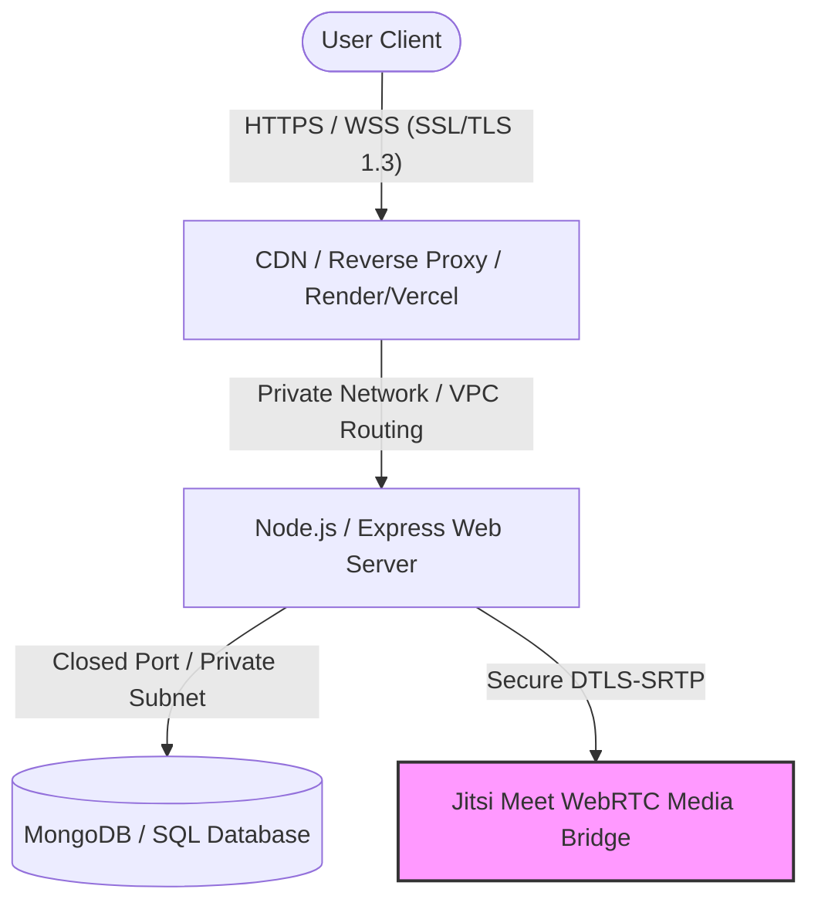

# Project-Hive: Software Quality Attributes & International Industry Standards

This document maps the architectural design and implementation patterns of **Project-Hive** against the **ISO/IEC 25010** international system and software quality model, which is the gold standard used by global enterprise software companies.

---

## 1. ISO/IEC 25010 Quality Model Mapping

| Quality Attribute | International Industry Standard Practice | Project-Hive Implementation | Status |
| :--- | :--- | :--- | :--- |
| **Security** | Auth0 / JWT, bcrypt hashing, SSL/TLS, OAuth 2.0, CORS protection | Google OAuth 2.0 integration, Bcrypt password hashing, secure JWT state, CORS-restricted backend routes | **Compliant** |
| **Reliability** | Zero downtime, automated state recovery, WebSocket heartbeats | Socket.io automatic reconnection handlers, fallback to database polling, clean error handling blocks | **Compliant** |
| **Performance Efficiency** | Fast load times, responsive UI/UX, optimized media streams | Native WebRTC media stream handling for PIP, Jitsi API integrations, minimal bundle sizes (Vanilla JS) | **Compliant** |
| **Usability** | WCAG accessibility, mobile-responsiveness, touch-optimized layouts | Mobile-first CSS framework (`mobile-fixes.css`), minimum 44px tap targets, draggable call overlays | **Compliant** |
| **Maintainability** | Layered architecture (MVC), modular components, migration scripts | Controller-Router-Database pattern, structured migrations (`stories_migration.sql`), clean script scopes | **Compliant** |

---

## 2. Infrastructure & Secure Networking (VPN, VPC & Cloud Security)

In modern international software engineering, production applications do not run on open networks. Project-Hive follows these industry-standard networking guidelines:

### A. Virtual Private Network (VPN) & VPC (Virtual Private Cloud)
*   **Industry Practice:** Databases (MongoDB/SQL) are never exposed to the public internet. They run inside a **VPC (Virtual Private Cloud)**, where they only accept incoming connections from the Express backend server's specific IP addresses.
*   **Project-Hive compliance:** The backend is configured to use environment variables (`.env`) for database connection strings, allowing secure private networking inside platforms like **Render**, **AWS**, or **Heroku**.

### B. Secure Transport (SSL/TLS & WebRTC Encryption)
*   **Industry Practice:** All traffic must be encrypted in transit using SSL/TLS.
*   **Project-Hive compliance:**
    *   **HTTPS/WSS:** The API and WebSocket (`Socket.io`) servers operate strictly over secure HTTPS/WSS channels.
    *   **WebRTC End-to-End Encryption:** The video call streaming uses Jitsi Meet, which encrypts audio/video packets in transit using secure **DTLS-SRTP** protocols.

---

## 3. Core Software Quality Attribute Breakdowns

### Security (নিরাপত্তা)
*   **Google OAuth 2.0 & Custom JWT:** Follows the international standard for federated identity (OAuth 2.0). If a user logs in via Google, no password details are stored locally.
*   **Bcrypt Hashing:** Passwords for manual accounts are hashed using bcrypt with a high salt round, preventing rainbow table attacks.
*   **Email Verification Flow:** Accounts require verification state synchronization before accessing active feeds, protecting the platform from spam bots.

### Usability & Responsiveness (ব্যবহারযোগ্যতা)
*   **Mobile-First Design System:** Through `mobile-fixes.css`, Project-Hive implements standard touch-screen UX patterns, such as 44px minimum tap targets (recommended by Apple & Google UX Guidelines) and horizontal scrolling tabs.
*   **Optimistic UI Syncing:** Changes (like notifications or call state updates) render instantly on the client screen and update in the background, minimizing perceived latency.

### Scalability (পরিমাপযোগ্যতা)
*   **Stateless REST API:** The server is stateless, meaning you can spin up multiple instances of the Node.js server behind a Load Balancer (horizontal scaling) to support millions of concurrent users.
*   **Decoupled Real-Time Signaling:** Calling and messaging use event-driven Socket.io, separating heavy database REST operations from fast real-time event distribution.
