# ProjectHive — System Documentation

> **A Student Collaboration & Team Formation Platform**  
> Version 1.0 | Last Updated: June 24, 2026

---

## 1. What is ProjectHive?

ProjectHive is a **full-stack web platform** that helps university students find teammates, collaborate on projects, and showcase their work — all in one place.

Think of it as **LinkedIn + Slack + GitHub**, designed specifically for students.

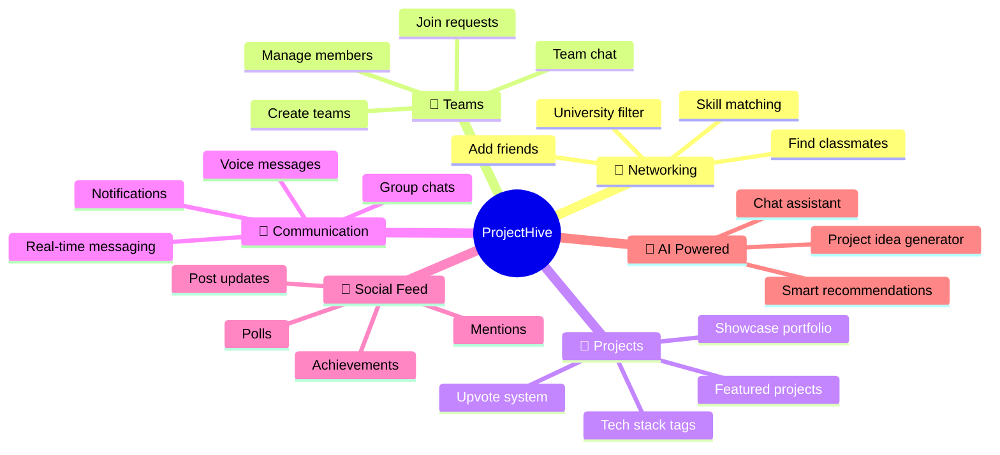

---

## 2. Why Was It Built?

### The Problem

University students face these challenges every semester:

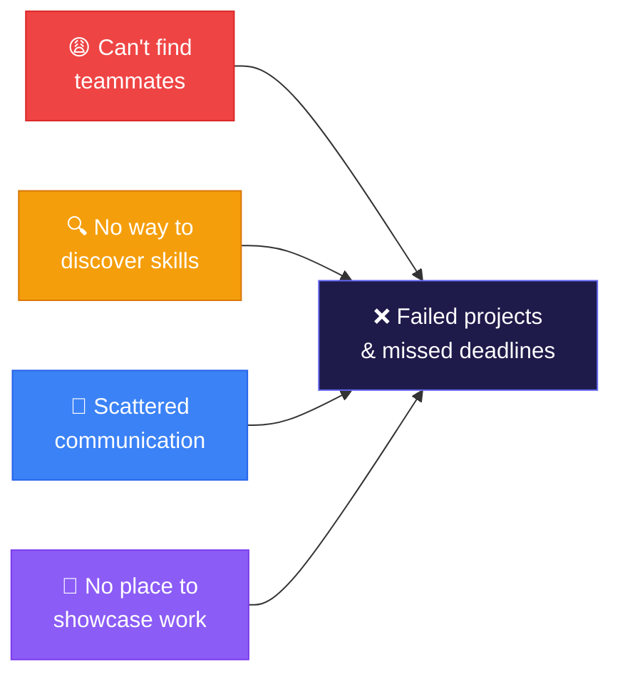

### The Solution

ProjectHive solves all of these in one platform:

| Problem | ProjectHive Solution |
|---------|---------------------|
| Can't find teammates | **People Discovery** with skill filtering, university search, AI recommendations |
| Don't know who has what skills | **Skill Profiles** with endorsements, searchable across the platform |
| Communication is scattered | **Real-time Messaging** with DMs, team group chats, voice messages |
| No place to showcase work | **Project Showcase** with upvotes, featured projects, tech stack tags |
| Hard to form study groups | **Team System** with create, join, manage, and collaborate features |
| No motivation to share progress | **Social Feed** with posts, achievements, polls, reactions |

---

## 3. System Architecture

### High-Level Overview

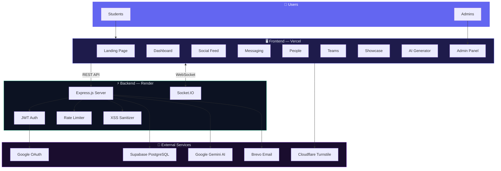

### Technology Stack

| Layer | Technology | Purpose |
|-------|-----------|---------|
| **Frontend** | Vanilla HTML/CSS/JS | No framework dependency, fast loading |
| **Styling** | TailwindCSS + custom CSS | Premium UI design system |
| **Icons** | Google Material Symbols | Consistent icon system |
| **Fonts** | Inter (Google Fonts) | Modern, readable typography |
| **Backend** | Node.js + Express.js | REST API server |
| **Database** | Supabase PostgreSQL | 13 tables, RLS security |
| **Real-time** | Socket.IO | WebSocket for messaging & notifications |
| **AI** | Google Gemini API | Project idea generation, chat assistant |
| **Auth** | JWT + Google OAuth | Secure authentication |
| **Email** | Brevo (Sendinblue) | Verification & password reset emails |
| **CAPTCHA** | Cloudflare Turnstile | Bot protection on login |
| **Hosting** | Vercel + Render | Frontend CDN + backend server |

---

## 4. Complete Feature Map

### User Journey

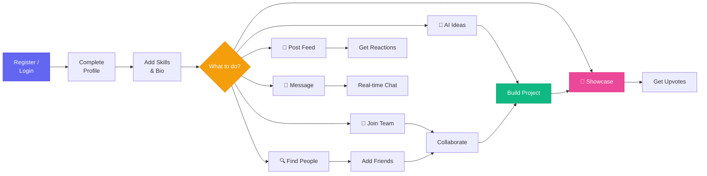

---

## 5. Feature Details

### 5.1 Authentication System

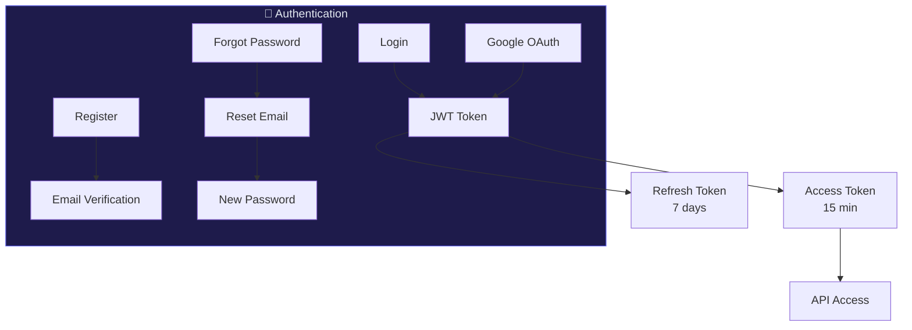

| Feature | Description |
|---------|-------------|
| Email + Password | Standard registration with bcrypt hashing |
| Google OAuth | One-click sign in via Supabase provider |
| Email Verification | Verification email with clickable link |
| Forgot Password | Email-based password reset flow |
| JWT Tokens | Access (15m) + Refresh (7d) token pair |
| Auto Refresh | Token auto-refreshes before expiry |
| CAPTCHA | Cloudflare Turnstile on login form |
| Rate Limiting | 20 attempts / 15 minutes on auth endpoints |

---

### 5.2 Dashboard

The main hub after login. Shows everything at a glance.

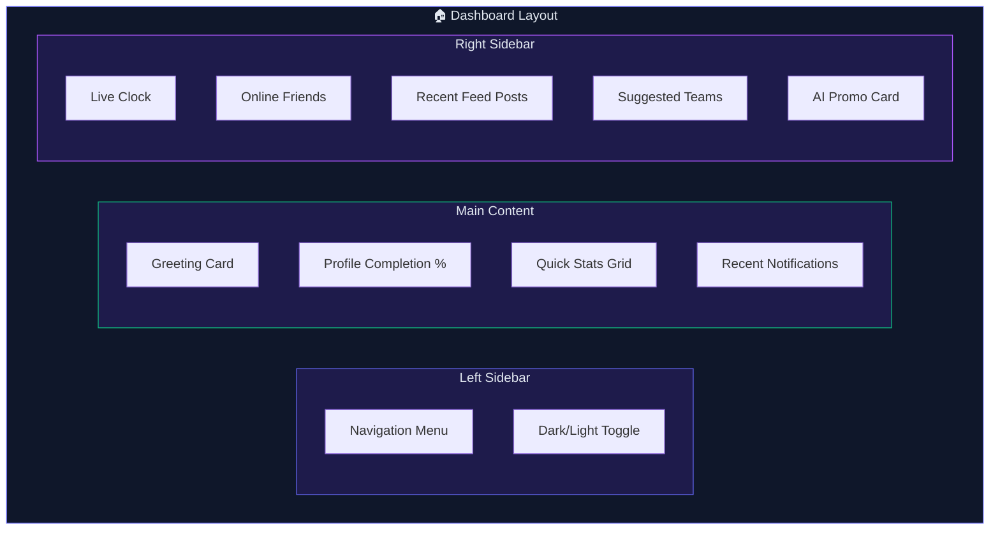

| Widget | What It Shows |
|--------|--------------|
| Greeting Card | "Good morning, [Name]" with time-aware greeting |
| Profile Completion | Progress bar with % and step indicator |
| Quick Stats | 4 cards — Teams, Friends, Projects, Messages count |
| Notifications | Latest 5 alerts with mark-all-read |
| Online Friends | Friends currently active (green dot) |
| Recent Feed | Last 3 posts from the social feed |
| Suggested Teams | 3 teams you might want to join |
| AI Promo | CTA card linking to AI Generator |
| Live Clock | Real-time clock with date |

---

### 5.3 Social Feed

A LinkedIn-style feed for sharing updates, achievements, and polls.

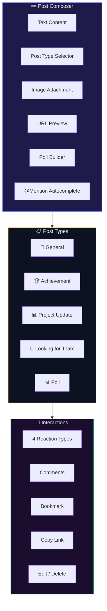

| Feature | How It Works |
|---------|-------------|
| Post Types | 5 types — each renders with unique color styling |
| @Mentions | Type `@` → popover appears → select user → highlighted in post |
| Polls | Create 2-5 options → users vote → live % bars update |
| Reactions | Like, Celebrate, Insightful, Support (one per user) |
| Comments | Threaded comments with edit/delete |
| Link Preview | Paste URL → server scrapes title, description, image |
| Image Upload | Attach image with preview before posting |
| Bookmark | Save posts to your Saved collection |

---

### 5.4 Messaging System

Full real-time chat with DMs, team groups, voice, and more.

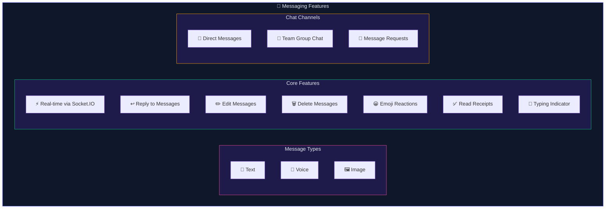

| Feature | Description |
|---------|-------------|
| Real-time delivery | Messages appear instantly via WebSocket |
| Voice messages | Record with live waveform → send as audio |
| Image attachments | Drag & drop or click to attach |
| Reply | Quote any message with preview |
| Edit | Modify your sent messages |
| Reactions | React with emoji to any message |
| Read receipts | Blue checkmarks when read |
| Typing indicator | "User is typing..." feedback |
| Message requests | Non-friends go to request inbox |
| Delete | Remove individual messages or entire conversations |

---

### 5.5 People & Networking

```mermaid
graph LR
    subgraph DISCOVER["🔍 Discovery"]
        SEARCH["Search by Name,<br/>University, Skills"]
        FILTER["Filter Chips:<br/>All, Available,<br/>Web, AI, Mobile"]
        UNI["University<br/>Dropdown Filter"]
    end

    subgraph NETWORK["🤝 Networking"]
        ADD["Send Friend Request"]
        ACCEPT["Accept / Decline"]
        UNFRIEND["Remove Friend"]
        MUTUAL["Mutual Friends Count"]
    end

    subgraph VIEWS["📑 Tabs"]
        T1["Discover"]
        T2["Recommended"]
        T3["My Friends"]
        T4["Requests"]
    end

    DISCOVER --> NETWORK
    VIEWS --> DISCOVER

    style DISCOVER fill:#1e1b4b,stroke:#3b82f6,color:#e2e8f0
    style NETWORK fill:#0c1222,stroke:#10b981,color:#e2e8f0
    style VIEWS fill:#1a0d2e,stroke:#a855f7,color:#e2e8f0
```

| Feature | Description |
|---------|-------------|
| Discover | Browse all users with profile cards |
| Recommended | AI-powered suggestions based on mutual friends |
| Search | By name, university, or skills |
| Skill filters | Web Dev, AI/ML, Mobile Dev chip filters |
| University filter | Dropdown populated from all users' universities |
| Friend requests | Send, accept, decline with real-time UI updates |
| Unfriend | Remove friends from My Friends tab |
| Mutual count | "3 mutual friends" shown on recommended cards |

---

### 5.6 Teams & Collaboration

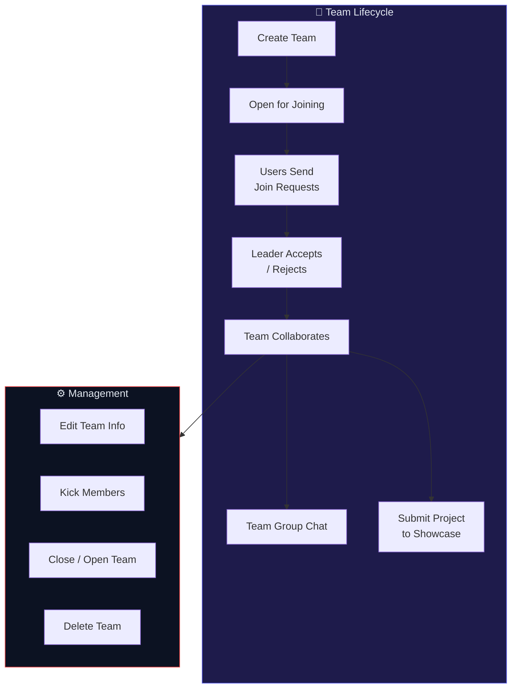

| Feature | Description |
|---------|-------------|
| Create team | Name, description, category, tags, max size |
| Browse teams | Grid view with search and open/closed filter |
| Join request | Send request → leader approves → you're in |
| Team chat | Real-time group messaging |
| Edit team | Update name, description, category, tags |
| Kick members | Leader can remove any member |
| Leave team | Members can leave voluntarily |
| Close/Open | Toggle team availability |

---

### 5.7 Project Showcase

```mermaid
graph LR
    subgraph SUBMIT["📤 Submit Project"]
        TITLE["Title & Description"]
        TECH["Tech Stack Tags"]
        LINKS["GitHub + Demo URLs"]
        CAT["Category Selection"]
    end

    subgraph DISPLAY["🖼️ Showcase"]
        CARDS["Project Cards Grid"]
        DETAIL["Detail Modal"]
        BADGE["⭐ Featured Badge"]
        MEMBERS["Looking for Members"]
    end

    subgraph INTERACT["❤️ Interactions"]
        UPVOTE["Upvote / Like"]
        BOOKMARK["Bookmark / Save"]
        EDIT_P["Edit Project"]
        DELETE_P["Delete Project"]
    end

    SUBMIT --> DISPLAY --> INTERACT

    style SUBMIT fill:#1e1b4b,stroke:#10b981,color:#e2e8f0
    style DISPLAY fill:#0c1222,stroke:#f59e0b,color:#e2e8f0
    style INTERACT fill:#1a0d2e,stroke:#ec4899,color:#e2e8f0
```

---

### 5.8 AI Generator

Powered by **Google Gemini API** (`gemini-2.0-flash`).

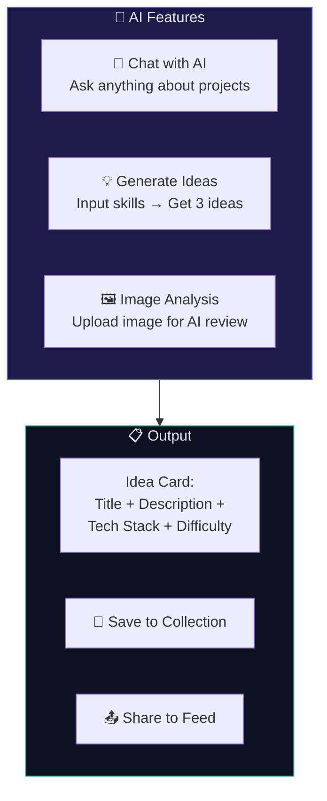

| Feature | Description |
|---------|-------------|
| AI Chat | Natural language conversation about project ideas |
| Idea Generation | Input your skills + interests → get 3 structured project suggestions |
| Idea Cards | Title, description, tech stack, difficulty level |
| Save Idea | Save to localStorage collection for later |
| Share to Feed | Post idea to social feed with `#ProjectIdea` tag |
| Image Analysis | Upload an image → AI analyzes and discusses it |

---

### 5.9 Admin Panel

Full moderation and system management dashboard.

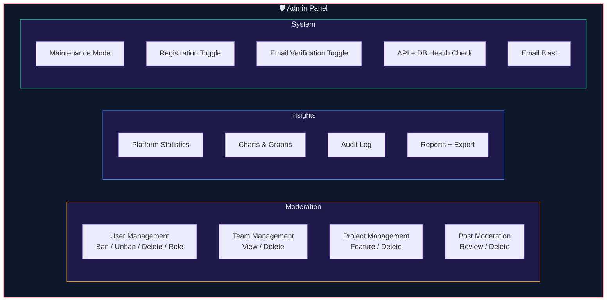

| Section | Capabilities |
|---------|-------------|
| **Users** | Search, filter by role, ban/unban, promote/demote, delete |
| **Teams** | Browse all, filter open/closed, delete |
| **Projects** | Browse all, feature/unfeature, delete |
| **Posts** | View with content preview + attachments, delete |
| **Analytics** | User distribution chart, team status chart |
| **Audit Log** | Logs all admin actions (ban, delete, role change) with timestamps |
| **Reports** | 8-stat summary + JSON export download |
| **Email Blast** | Compose email → target All/Students/Admins → send |
| **System** | Maintenance mode, registration, email verification toggles |
| **Health** | Live API and database connection status |

---

### 5.10 Settings & Profile

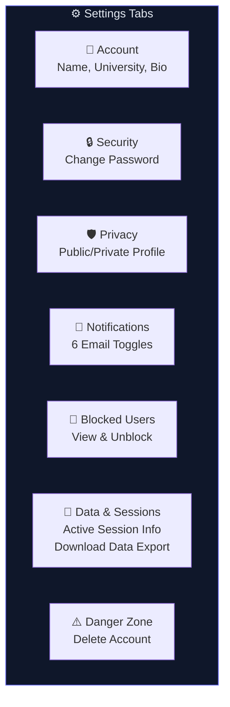

---

### 5.11 Notifications

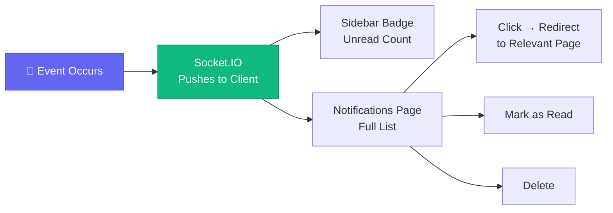

| Notification Type | Trigger | Redirect |
|------------------|---------|----------|
| Friend Request | Someone sends you a request | People → Requests |
| Team Invite | Invited to join a team | Teams page |
| Message | New message received | Messages |
| Post Reaction | Someone reacts to your post | Feed → Post |
| Comment | Someone comments on your post | Feed → Post |

---

## 6. Security Architecture

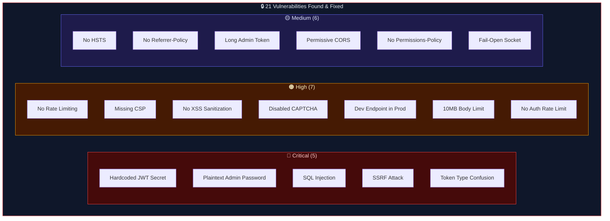

**All 21 vulnerabilities have been fixed.** See `docs/SECURITY_AUDIT.md` for full details.

---

## 7. Platform Statistics

| Metric | Count |
|--------|-------|
| HTML Pages | 26 |
| API Endpoints | 90+ |
| Database Tables | 13 |
| Controllers | 11 |
| Route Files | 10 |
| Security Fixes | 21 |
| Socket.IO Events | 10+ |
| Post Types | 5 |
| Reaction Types | 4 |
| Settings Tabs | 7 |
| Admin Sections | 10 |

---

## 8. Deployment Architecture

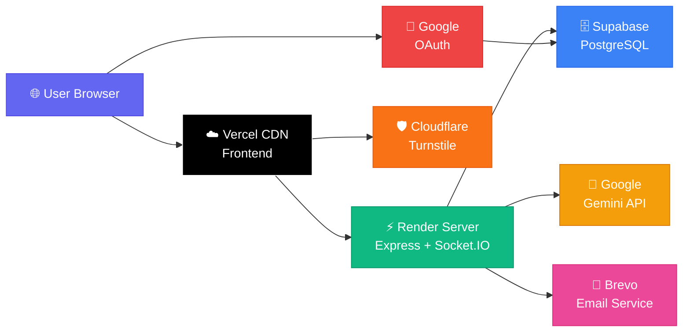

| Service | URL | Purpose |
|---------|-----|---------|
| Frontend | `projecthive-bd.vercel.app` | Static HTML/CSS/JS hosting |
| Backend | `projecthive-backend.onrender.com` | API + WebSocket server |
| Database | Supabase cloud | PostgreSQL with RLS |
| Dev Frontend | `localhost:3000` | Local development |
| Dev Backend | `localhost:5000` | Local development |

---

*ProjectHive — Connecting students, building futures.*
